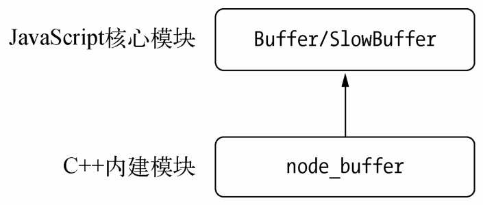
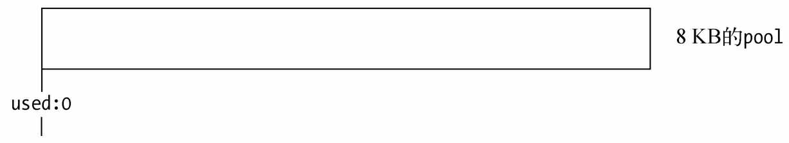
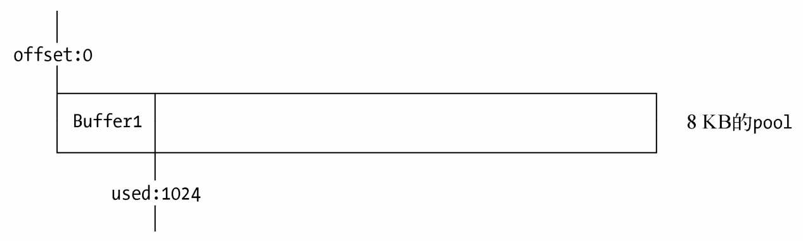

# Buffer结构
主要用于操作字节
javascript和C++ 结合的模块，javascript负责非性能相关的部分，C++负责性能相关的部分

- 用法
  直接使用，无须require(), node在进程启动时就已经加载了Buffer，并将其放到全局对象上
## Buffer对象
  类数组对象，元素为16进制的两位数-> 0-256的数值
  初始化对象后，它的元素值时0-256的一个随机值，我们也可以像数值赋值一样给它赋值

:::tip 
  给元素的赋值如果小于0，就将该值逐次加256，直到得到一个0到255之间的整数。如果得到的数值大于255，就逐次减256，直到得到0~255区间内的数值。如果是小数，舍弃小数部分，只保留整数部分。
:::
  ```javascript
    var buf = new Buffer(100)
    buf[19] = 100;
    console.log(buf[19]); // 100
    buf[20] = -100;
    console.log(buf[20]); // 156
    buf[21] = 300;
    console.log(buf[21]); // 44
    buf[22] = 3.1415;
    console.log(buf[22]); // 3
  ```

## Buffer内存分配
Node在内存的使用上应用的是在C++层面申请内存、在JavaScript中分配内存的策略。
为了高效的使用申请来的内存，Node采用slab分配机制
slab分配机制(一块申请好的固定大小的内存区域)
8kb为界限区分Buffer是大对象还是小对象，8kb就是每个slab的大小值(在javascript以此作为单位单元进行内存的分配)

slab三种状态
- full 完全分配状态
- partial 部分分配状态
- empty 没有被分配的状态

### 分配Buffer小对象
>大小< 8KB -> 小对象方式进行分配
>使用一个局部变量pool作为中间处理对象，处于分配状态的slab单元都指向它(pool.used表示slab已经分配的内存)

- 分配一个新的slab单元
```javascript
  var pool;
  function allocPool() {
    pool = new SlowBuffer(Buffer.poolSize);
    pool.used = 0;
  }
```
- 新构造的slab单元,empty状态


构造时检查是否有pool对象，如果没有就创建，然后创建一个新的slab指向它，同时Buffer的parent属性指向slab，并记录起始使用位置(offset)。<br/>
再次创建一个Buffer对象时，会先判断slab的剩余空间是否足够，如果足够就是用剩余空间，并更新使用状态，如果不够就分配新的slab单元
- 初次分配Buffer

- 再次分配Buffer


>slab回收只有再该单元所有Buffer释放后才能被回收


### 分配Buffer大对象
直接分配一个SlowBuffer对象作为slab单元，SlowBuffer对象是在C++层面定义的，可用Buffer模块访问到
> Buffer对象可被V8的垃圾回收标记回收，但内部的parent指向SlowBuffer来自C++层，所用内存不在V8堆中

## 小结
真正的内存在Node的C++层面，Javascript只是使用它。当进行小而频繁的Buffer操作时，采用slab的机制进行预先申请和事后分配，使得JavaScript到操作系统之间不必有过多的内存申请方面的系统调用。对于大块的Buffer而言，则直接使用C++层面提供的内存，而无需细腻的分配操


