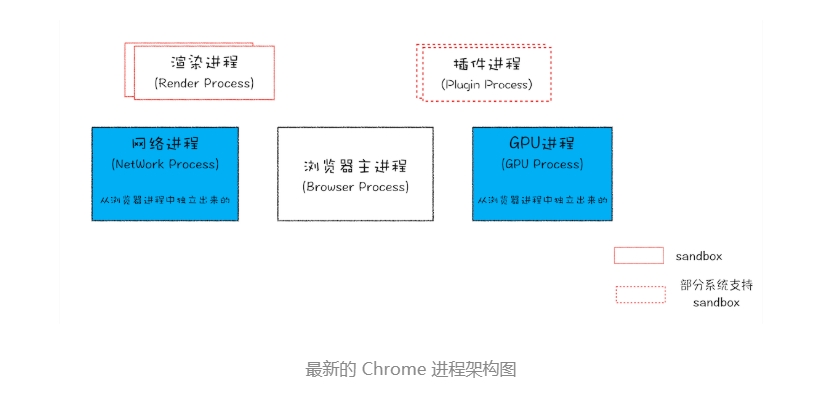
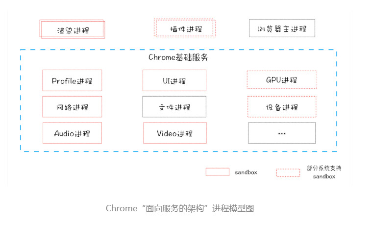

# 浏览器进程历史
## 单进程浏览器时代
单进程浏览器是指浏览器的所有功能模块都是运行在同一个进程里，这些模块包含了网络、插件、JavaScript 运行环境、渲染引擎和页面等 
因为所有的功能模块都运行在一个进程中，所以会出现众多问题： 
1. 不稳定，只要一个模块出现了问题就会导致整个浏览器出现问题
2. 不安全，所有页面的渲染模块、JavaScript 执行环境以及插件都是运行在同一个线程中的，这就意味着同一时刻只能有一个模块可以执行
3. 不流畅，插件可以使用 C/C++ 等代码编写，通过插件可以获取到操作系统的任意资源，当你在页面运行一个插件时也就意味着这个插件能完全操作你的电脑。如果是个恶意插件，那么它就可以释放病毒、窃取你的账号密码，引发安全性问题。
至于页面脚本，它可以通过浏览器的漏洞来获取系统权限，这些脚本获取系统权限之后也可以对你的电脑做一些恶意的事情，同样也会引发安全问题。

## 目前的多进程
最新的 Chrome 浏览器包括：1 个浏览器（Browser）主进程、1 个 GPU 进程、1 个网络（NetWork）进程、多个渲染进程和多个插件进程。

1. 浏览器进程。主要负责界面显示、用户交互、子进程管理，同时提供存储等功能。
2. 渲染进程。核心任务是将 HTML、CSS 和 JavaScript 转换为用户可以与之交互的网页，排版引擎 Blink 和 JavaScript 引擎 V8 都是运行在该进程中，默认情况下，Chrome 会为每个 Tab 标签创建一个渲染进程。出于安全考虑，渲染进程都是运行在沙箱模式下。
3. GPU 进程。其实，Chrome 刚开始发布的时候是没有 GPU 进程的。而 GPU 的使用初衷是为了实现 3D CSS 的效果，只是随后网页、Chrome 的 UI 界面都选择采用 GPU 来绘制，这使得 GPU 成为浏览器普遍的需求。最后，Chrome 在其多进程架构上也引入了 GPU 进程。
4. 网络进程。主要负责页面的网络资源加载，之前是作为一个模块运行在浏览器进程里面的，直至最近才独立出来，成为一个单独的进程。
插件进程。主要是负责插件的运行，因插件易崩溃，所以需要通过插件进程来隔离，以保证插件进程崩溃不会对浏览器和页面造成影响。

一般来说，仅仅打开了 1 个页面，至少需要 1 个网络进程、1 个浏览器进程、1 个 GPU 进程以及 1 个渲染进程，**共 4 个**；如果打开的页面有运行插件的话，还需要再加上 1 个插件进程。

虽然多进程模型提升了浏览器的稳定性、流畅性和安全性，但同样不可避免地带来了一些问题：

1. 更高的资源占用。因为每个进程都会包含公共基础结构的副本（如 JavaScript 运行环境），这就意味着浏览器会消耗更多的内存资源。
2. 更复杂的体系架构。浏览器各模块之间耦合性高、扩展性差等问题，会导致现在的架构已经很难适应新的需求了

## 未来面向服务的架构
为了解决这些问题，在 2016 年，Chrome 官方团队使用“面向服务的架构”（Services Oriented Architecture，简称SOA）的思想设计了新的 Chrome 架构。也就是说 Chrome 整体架构会朝向现代操作系统所采用的“面向服务的架构” 方向发展，原来的各种模块会被重构成独立的服务（Service），每个服务（Service）都可以在独立的进程中运行，访问服务（Service）必须使用定义好的接口，通过 IPC 来通信，从而构建一个更内聚、松耦合、易于维护和扩展的系统，更好实现 Chrome 简单、稳定、高速、安全的目标 
Chrome 最终要把 UI、数据库、文件、设备、网络等模块重构为基础服务，类似操作系统底层服务，下面是 Chrome“面向服务的架构”的进程模型图：

