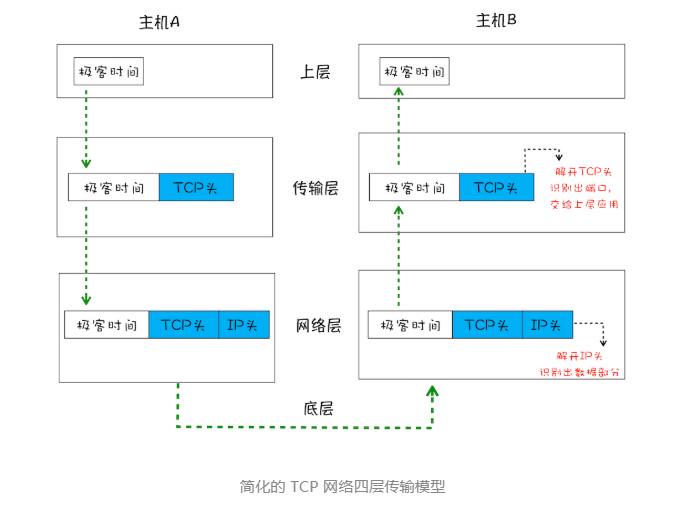

# tcp页面传输
## ip传输
数据要在互联网上进行传输，就要符合IP协议 
计算机的地址就称为 IP 地址，访问任何网站实际上只是你的计算机向另外一台计算机请求信息。 
通过ip我们可以向另一台计算机输送数据
1. 上层将数据包交给网络层；
2. 网络层再将 IP 头附加到数据包上，组成新的 IP 数据包，并交给底层；
3. 底层通过物理网络将数据包传输给主机 B；
4. 数据包被传输到主机 B 的网络层，在这里主机 B 拆开数据包的 IP 头信息，并将拆开来的数据部分交给上层；
最终，含有“极客时间”信息的数据包就到达了主机 B 的上层了。

但是这里我们有一个问题，就是我们并不知道我们的数据传到了计算机的哪里，传到了哪个程序，这是一个很大的问题，所以这时候我们就要用udp协议来保证我们的传输位置。
## UDP协议(用户数据包协议)下的传输
UDP 中一个最重要的信息是端口号，端口号其实就是一个数字，每个想访问网络的程序都需要**绑定一个端口号**。通过端口号 UDP 就能把指定的数据包发送给指定的程序了，所以*IP 通过 IP 地址信息把数据包发送给指定的电脑，而 UDP 通过端口号把数据包分发给正确的程序*

用UDP协议的话，计算机将数据包交给传输层，由传输层给数据包头部加上UDP头，具体如下： 
1. 上层将含有“极客时间”的数据包交给传输层；
2. 传输层会在数据包前面附加上UDP 头，组成新的 UDP 数据包，再将新的 UDP 数据包交给网络层；
3. 网络层再将 IP 头附加到数据包上，组成新的 IP 数据包，并交给底层；
4. 数据包被传输到主机 B 的网络层，在这里主机 B 拆开 IP 头信息，并将拆开来的数据部分交给传输层；
5. 在传输层，数据包中的 UDP 头会被拆开，并根据 UDP 中所提供的端口号，把数据部分交给上层的应用程序；

但是由于UDP无连接，有可能出现数据包出错的状况，UDP对于错误的数据包，没有重发机制，只是丢弃当前的包，计算机也得不到相应的反馈。所以UDP协议用在需要精准反馈的数据包传输中是不合适的，虽说UDP 不能保证数据可靠性，但是传输速度却非常快，所以 UDP 会应用在一些关注速度、但不那么严格要求数据完整性的领域，如在线视频、互动游戏等

## TCP
使用 UDP 来传输会存在两个问题： 
1. 数据包在传输过程中容易丢失；
2. 大文件会被拆分成很多小的数据包来传输，这些小的数据包会经过不同的路由，并在不同的时间到达接收端，而 UDP 协议并不知道如何组装这些数据包，从而把这些数据包还原成完整的文件。

这时候我们就改用TCP协议来传输了，TCP（Transmission Control Protocol，传输控制协议）是一种面向连接的、可靠的、基于字节流的传输层通信协议。相对于 UDP，TCP 有下面两个特点: 

1. 对于数据包丢失的情况，TCP 提供重传机制；
2. TCP 引入了数据包排序机制，用来保证把乱序的数据包组合成一个完整的文件。

和 UDP 头一样，TCP 头除了包含了目标端口和本机端口号外，还提供了用于排序的序列号，以便接收端通过序号来重排数据包。 

## 总结
1. 互联网中的数据是通过数据包来传输的，数据包在传输过程中容易丢失或出错。
2. IP 负责把数据包送达目的主机。
3. UDP 负责把数据包送达具体应用。
4. 而 TCP 保证了数据完整地传输，它的连接可分为三个阶段：建立连接、传输数据和断开连接。