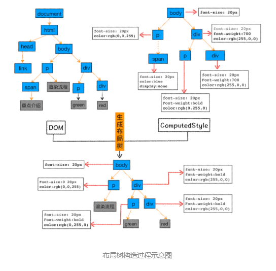

# 从url输入到渲染中间发生了什么
## 导航
1. 用户输入信息，如果是关键字，浏览器就合成一个带搜索关键字的url，并使用默认搜索引擎搜索。
2. 如果是url，浏览器补全协议，进入页面资源请求阶段
3. 进程间通信(ipc)把url请求发送给网络进程处理，网络进程先读取本地缓存，有有用的缓存就用缓存，不发送网络请求
4. 发送网络请求，先进行DNS解析，先访问本地dns是否有缓存，没有就去DNS服务器解析，然后将解析到的ip返回
5. 网络进程利用IP地址和服务器建立tcp连接，如果是https，还要建立TLS连接，浏览器端会构建请求行、请求头等信息，并把和该域名相关的 Cookie 等数据附加到请求头中，然后向服务器发送构建的请求信息。
5. 服务器根据请求信息，返回给网络进程相应的响应信息，网络进程解析响应头内容
  - 状态码301，302重定向，网络进程根据location的url再次发送请求
  - Content-Type:text/html -> html格式，application/octet-stream，显示数据是字节流类型的，通常情况下，浏览器会按照下载类型来处理该请求
6. 通常情况下，打开新的页面都会使用单独的渲染进程；
如果从 A 页面打开 B 页面，且 A 和 B 都属于同一站点的话，那么 B 页面复用 A 页面的渲染进程；如果是其他情况，浏览器进程则会为 B 创建一个新的渲染进程。
7. 提交文档，浏览器进程发出“提交文档”的信息，渲染进程接收到后，会和网络进程建立数据传输的“管道”，数据传输完成，渲染进程发出“确认提交”信息，浏览器收到信息后，更新浏览器界面状态
## 渲染流程
### 构建DOM树
浏览器无法直接理解和使用 HTML，所以需要将 HTML 转换为浏览器能够理解的结构——DOM 树
### 样式计算
浏览器也无法理解css 所以要先将css转成浏览器能理解的结构 styleSheets 
将css属性标准化(将所有值转换为渲染引擎容易理解的、标准化的计算值) 
计算出DOM树中每个节点的具体样式,他有两个规则，继承规则(每个DOM节点都包含父节点中的样式)，层叠规则
### 生成布局树
那么接下来就需要计算出 DOM 树中可见元素的几何位置，我们把这个计算过程叫做布局。 
1. 创建布局树，只包含可见DOM
2. 布局计算，计算布局树节点位置

### 分层绘制
因为页面复杂，可能会有如3d变换，滚动之类的效果，为了更加方便地实现这些效果，渲染引擎还需要为特定的节点生成专用的图层，并生成一棵对应的图层树，然后就要绘制图层，会有相应的绘制列表，实际上真正的绘制是由渲染引擎中的合成线程来执行的。
- 当绘制列表准备好后，主进程会把绘制列表**提交**给合成线程
- 合成线程会把图层分为图块，优先将视口的图块生成位图，这个操作是由栅格化实现的，栅格化使用GPU加速保生成，生成的位图保存在GPU内存中。
- 当所有的图块都被栅格化，合成线程就会发送一个生成绘制图块的命令“DrawQuad”给浏览器主进程
- 浏览器有个叫viz的组件接受DrawQuad命令后，将页面内容绘制到内存中，再将内存显示到屏幕上

### 总结
渲染流程：DOM 生成->样式计算->布局->生成分层树->生成并提交绘制列表->光栅化图块->发送DrawQuad命令->绘制并显示到页面。要点可大致总结为如下： 

1. 浏览器不能直接理解 HTML 数据，所以第一步需要将其转换为浏览器能够理解的 DOM 树结构；
2. 生成 DOM 树后，还需要根据 CSS 样式表，来计算出 DOM 树所有节点的样式；
3. 最后计算 DOM 元素的布局信息，使其都保存在布局树中。
4. 对布局树进行分层，并生成分层树。
5. 为每个图层生成绘制列表，并将其提交到合成线程。
6. 合成线程将图层分成图块，并在光栅化线程池中将图块转换成位图。
7. 合成线程发送绘制图块命令DrawQuad给浏览器进程。
8. 浏览器进程根据 DrawQuad 消息生成页面，并显示到显示器上。
