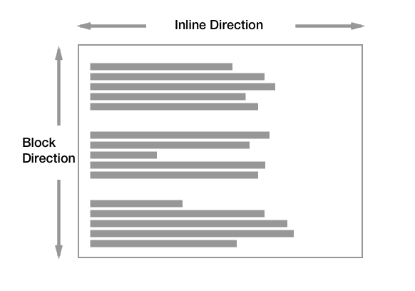
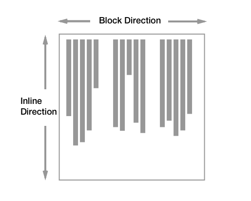
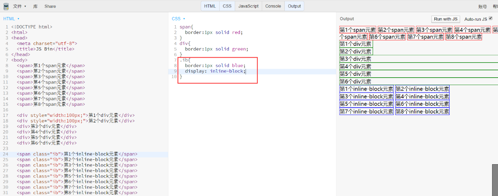
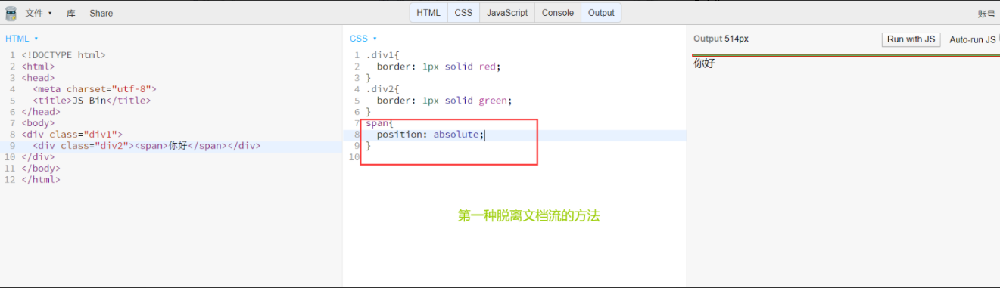

# 正常流（normal flow）

>CSS 2.1规范定义了常规流（Normal Flow），并规定一个格式化上下文（formatting context）是由常规流中的盒子构成的。盒子可以是块级盒子也可以是内联盒子，但不能同时是块级和内联盒子。块级盒子构成块级格式化上下文（block formatting context），内联盒子构成内联格式化上下文（inline formatting context）。

## 块布局
在块格式上下文中，从包含块的顶部开始，一个接一个地垂直排列框。两个同级框之间的垂直距离由“Margin”属性确定。块格式上下文中相邻块级框之间的垂直边距折叠。
根据书写模式的不同，排列也不同：
1. 水平书写模式

2. 垂直书写模式

## 内敛布局

inline元素从左到右，到达最右边才会换行；

inline-block也是从左到右；

注：inline-block元素不会像inline元素一样出现头在上一行，尾在下一行的情况，inline元素一定是成块的，既具有inline的特性又兼顾了block；

总体示意图： 

## 宽度
inline宽度为内部内联元素宽度的和，不能用width指定，（设置了等于没设置）；

注：不要在inline元素里面用block的元素，不要写就对了；

block默认自动计算宽度（宽度是自动适应而不是100%的），可用width指定；
注：永远不要写

inline-block：默认不指定宽度的情况下，宽度是和inline元素一样，根据内容而定；设定宽度时，又和block一样，可以设定。

## 高度
- inline的高度由line-height设置，和height无关。padding只是撑高了可视高度，实际高度还是自身或父div的高度
- block高度由内部文档流元素决定，还可以设置height;
- inline-block跟block类似，可以设置height;

## overflow溢出
当设置的高度小于所需要的内容的时,我们可以用overflow的多种属性解决(overflow默认为visible。默认，超出就超出，可以看到。)：
- overflow: hidden直接隐藏 溢出部分
- 用overflow: scroll设置滑动显示(即使内容高度没有超出也会有滚动条)
- overflow: auto灵活设置(只有超出的时候才会显示滚动条)

横向滚动条什么时候显示呢？ -> 给div1里面加个文档流元素，而且是有自己宽度的文档流元素

## 脱离文档流
### absolute定位（fixed定位也是一样，只是包含块不一样）

### float
浮动的概念:浮动元素会脱离文档流并向左/向右浮动，直到碰到父元素或者另一个浮动元素。 
效果和上图一样

### 清除浮动
创建一个BFC

clear:both
