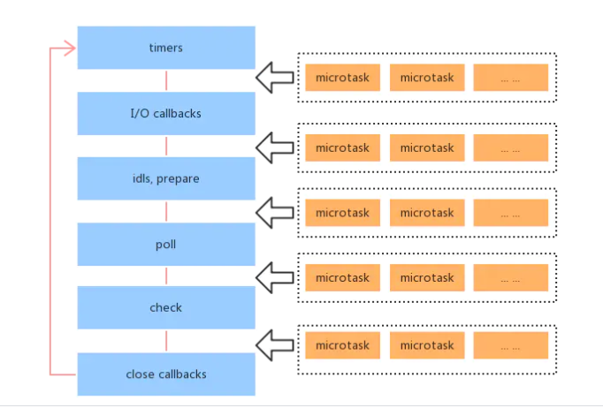

 # Event Loop

Event Loop是一个程序结构，用于等待和分派消息和事件我个人的理解是 JS 中的 Event Loop 是浏览器或 Node 的一种协调 JavaScript 单线程运行时不会阻塞的一种机制。

## 进程和线程
### javascript为什么是单线程的？
1. 语言特性决定js是单线程的
JavaScript 从诞生起就是单线程，原因大概是不想让浏览器变得太复杂，因为多线程需要共享资源、且有可能修改彼此的运行结果，对于一种网页脚本语言来说，这就太复杂了

### 浏览器的进程和线程
当我们在浏览器中新开一个tab页时，就相当于新开了一个进程。
在一个新开的进程中有这么几个线程：
1. GUI 渲染线程
- 绘制页面，解析 HTML、CSS，构建 DOM 树，布局和绘制等
- 页面重绘和回流
- 与 JS 引擎线程互斥，也就是所谓的 JS 执行阻塞页面更新
2. JS 引擎线程
- 负责 JS 脚本代码的执行
- 负责准执行准备好待执行的事件，即定时器计数结束，或异步请求成功并正确返回的事件
- 与 GUI 渲染线程互斥，执行时间过长将阻塞页面的渲染
2. 事件触发线程
- 负责将准备好的事件交给 JS 引擎线程执行
- 多个事件加入任务队列的时候需要排队等待(JS 的单线程)
3. 定时器触发线程
- 负责执行异步的定时器类的事件，如 setTimeout、setInterval
- 定时器到时间之后把注册的回调加到任务队列的队尾
4. HTTP 请求线程
- 负责执行异步请求
- 主线程执行代码遇到异步请求的时候会把函数交给该线程处理，当监听到状态变更事件，如果有回调函数，该线程会把回调函数加入到任务队列的队尾等待执行

## 浏览器中的event loop
### 宏任务

(macro)task（又称之为宏任务），可以理解是每次执行栈执行的代码就是一个宏任务（包括每次从事件队列中获取一个事件回调并放到执行栈中执行）。

浏览器为了能够使得JS内部 (macro)task 与 DOM 任务能够有序的执行，会在一个(macro)task执行结束后，在下一个(macro)task 执行开始前，对页面进行重新渲染，流程如下：

(macro)task-> 渲染 ->(macro)task->...

宏任务：
script(整体的代码)
setTimeout
setInterval
I/O 操作
UI 渲染 (对这个笔者持保留意见)

### 微任务
microtask（又称为微任务），可以理解是 在当前 task 执行结束后立即执行的任务。也就是说，在当前task任务后，下一个task之前，在渲染之前。

所以它的响应速度相比setTimeout（ setTimeout 是 task ）会更快，因为无需等渲染。也就是说，在某一个 macrotask 执行完后，就会将在它执行期间产生的所有 microtask 都执行完毕（在渲染前）

### 执行机制
在事件循环中，每进行一次循环操作称为 tick，每一次 tick 的任务处理模型是比较复杂的，但关键步骤如下：

- 执行一个宏任务（栈中没有就从事件队列中获取）
- 执行过程中如果遇到微任务，就将它添加到微任务的任务队列中。
- 宏任务执行完毕后，立即执行当前微任务队列中的所有微任务。（注意！！执行顺序也是按照产生顺序来的）
- 当前宏任务完全执行后，开始检查渲染，然后 GUI 线程接管渲染。
- 渲染完毕后，JS 线程继续接管，开始下一个宏任务（从事件队列中获取）


>执行同步任务，同步任务不需要做特殊处理，直接执行(下面的步骤中遇到同步任务都是一样处理) --- 第一轮从 script开始
从宏任务队列中取出队头任务执行
如果产生了宏任务，将宏任务放入宏任务队列，下次轮循的时候执行
如果产生了微任务，将微任务放入微任务队列
执行完当前宏任务之后，取出微任务队列中的所有任务依次执行
如果微任务执行过程中产生了新的微任务，则继续执行微任务，直到微任务的队列为空
轮循，循环以上 2 - 6
**总的来说就是：同步任务/宏任务 -> 执行产生的所有微任务(包括微任务产生的微任务) -> 同步任务/宏任务 -> 执行产生的所有微任务(包括微任务产生的微任务) -> 循环......**

## 具体题目

::: tip
1. async 隐式返回 Promise 作为结果
2. 执行完 await 之后直接跳出 async 函数，让出执行的所有权
3. 当前任务的其他代码执行完之后再次获得执行权进行执行
4. 立即 resolve 的 Promise 对象，是在本轮"事件循环"的结束时执行，而不是在下一轮"事件循环"的开始时

在chrome73(金丝雀)后，chrome对 async + await 进行了优化，大概就是用PromiseResolve 对 await 进行了优化，减少了 Promise 的再次创建,故而一段async + await 代码可以这么理解
```js
async function async1() {
  console.log('async1 start');
  await async2();
  console.log('async1 end');
}
等价于如下：

async function async1() {
	console.log('async1 start');
	Promise.resolve(async2()).then(() => {
    console.log('async1 end');
  })
}
```
:::


>chrome下执行
```js
async function async1() {
    console.log('async1 start');
    await async2();
    console.log('async1 end');
}
async function async2() {
	console.log('async2');
}

console.log('script start');

setTimeout(function() {
    console.log('setTimeout');
}, 0)

async1();

new Promise(function(resolve) {
    console.log('promise1');
    resolve();
}).then(function() {
    console.log('promise2');
});
console.log('script end');
```


<details>
<summary>答案</summary>

script start -> async1 start -> async2 -> promise1 -> script end ->  async1 end -> promise2 -> setTimeout
在firefox或者编译器中，promise2应该会比async end先输出

</details>

* * *

```js
async function async1() {
    console.log('async1 start');
    await async2();
    console.log('async1 end');
}
async function async2() {
    //async2做出如下更改：
    new Promise(function(resolve) {
    console.log('promise1');
    resolve();
}).then(function() {
    console.log('promise2');
    });
}
console.log('script start');

setTimeout(function() {
    console.log('setTimeout');
}, 0)
async1();

new Promise(function(resolve) {
    console.log('promise3');
    resolve();
}).then(function() {
    console.log('promise4');
});

console.log('script end');
```

<details>
<summary>答案</summary>

script start
async1 start
promise1
promise3
script end
promise2
async1 end
promise4
setTimeout

</details>

* * *

```js
async function async1() {
    console.log('async1 start');
    await async2();
    //更改如下：
    setTimeout(function() {
        console.log('setTimeout1')
    },0)
}
async function async2() {
    //更改如下：
	setTimeout(function() {
		console.log('setTimeout2')
	},0)
}
console.log('script start');

setTimeout(function() {
    console.log('setTimeout3');
}, 0)
async1();

new Promise(function(resolve) {
    console.log('promise1');
    resolve();
}).then(function() {
    console.log('promise2');
});
console.log('script end');
```

<details>
<summary>答案</summary>

script start
async1 start
promise1
script end
promise2
setTimeout3
setTimeout2
setTimeout1

</details>

* * *

```js
new Promise((resolve, reject) => {
  console.log("promise1")
  resolve()
})
.then(() => {
  console.log("then11")
  new Promise((resolve, reject) => {
    console.log("promise2")
    resolve()
  }) 
  .then(() => {
    console.log("then21")
    new Promise((resolve, reject) => {
      console.log("promise3")
      resolve()
    }).then(() => {
      console.log("then31")
    }).then(() => {
      console.log("then32")
    })
  })
  .then(() => {
    console.log("then22")
  })
}).then(() => {
  console.log("then12")
})

```
<details>
<summary>答案</summary>

promise1
then11
promise2
then21
promise3
then12
then31
then22
then32

个人感觉内层then进入微任务队列后，判断外层then

</details>


## node中的event loop
### 宏任务和微任务
Node 中的宏任务和微任务在浏览器端的 JS 相比增加了一些，这里只列出浏览器端没有的：
宏任务：<br/>
setImmediate
微任务<br/>
process.nextTick

### 执行过程

执行全局的 script 同步代码
执行微任务队列，先执行所有 Next Tick 队列中的所有任务，再执行其他的微任务队列中的所有任务
开始执行宏任务，共六个阶段，从第一个阶段开始执行自己宏任务队列中的所有任务(浏览器是从宏任务队列中取第一个执行！！)
每个阶段的宏任务执行完毕之后，开始执行微任务
TimersQueue -> 步骤2 -> I/O Queue -> 步骤2 -> Check Queue -> 步骤2 -> Close Callback Queue -> 步骤2 -> TimersQueue ...

这里要注意的是，nextTick 事件是一个单独的队列，它的优先级会高于微任务，所以在当前宏任务/同步任务执行完成之后，会先执行 nextTick 队列中的所有任务，再去执行微任务队列中的所有任务。


